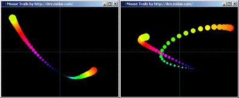



## TechniColor Mouse Trails

### Description

Simple mouse trails using recursion. Move the mouse over the form to display a colourful rainbow of colours that follow the mouse movement. You'll enjoy this, if you like watching pretty colours dance about the screen.
 
### More Info
 

             |
---                |---
**Submitted On**   |2003-09-21 13:09:02
**By**             |[Peter Wilson](https://github.com/Planet-Source-Code/PSCIndex/blob/master/ByAuthor/peter-wilson.md)
**Level**          |Beginner
**User Rating**    |5.0 (20 globes from 4 users)
**Compatibility**  |VB 6\.0
**Category**       |[Graphics](https://github.com/Planet-Source-Code/PSCIndex/blob/master/ByCategory/graphics__1-46.md)
**World**          |[Visual Basic](https://github.com/Planet-Source-Code/PSCIndex/blob/master/ByWorld/visual-basic.md)
**Archive File**   |[TechniColo1648389212003\.zip](https://github.com/Planet-Source-Code/peter-wilson-technicolor-mouse-trails__1-48676/archive/master.zip)

